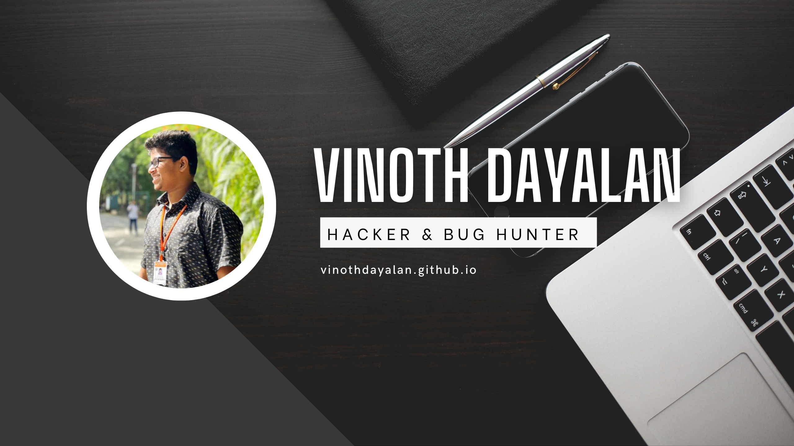

# 😎 About Me

Hi, my name is Vinoth and I am a *CyberSecurity student* . I am currently studying CyberSecurity and focusing on learning how to identify vulnerabilities in software , systems and WebSites . I am committed to use my skills ethically to help organizations protect their assets and prevent cyber attacks , My goal is to help , make the online world a safer place by finding and reporting vulnerabilities so that they can be fixed. As a student, I am eager to **learn** and **gain** practical experience in the field.

- 🔭 I’m currently working on **Bug hunting**

- 🌱 I’m currently learning **Web Engineering (Full-stack) , Socket programming , Learn the art of hacking through programming , Api development and bug Hunting**

- 👯 I’m looking to collaborate on **Pentesting**

- 🤝 I’m looking for help with **Sibidharan nandhakumar**

- 👨‍💻 All of my projects are available at [vinothdayalan.github.io](vinothdayalan.github.io)

- 💬 Ask me about **Pentesting , Frontend-development and Anyother Tech Stuff**

- 📫 How to reach me **vinothpreethi16@gmail.com**

# 💻 Skill Stack:
                        	     

### ✍️ Dev Quote

# 📊 GitHub Stats:
 
 

